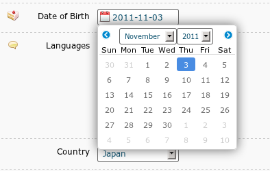
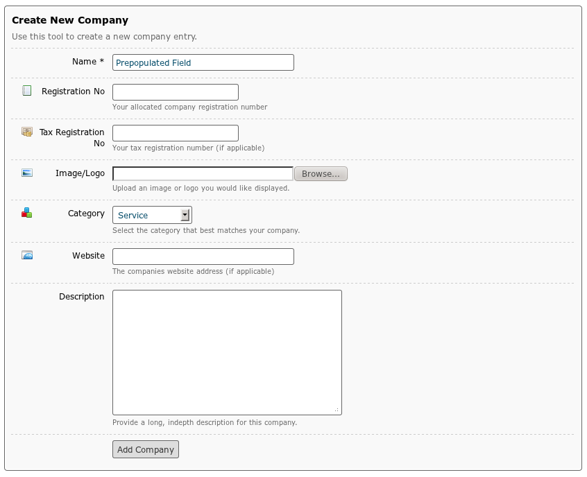
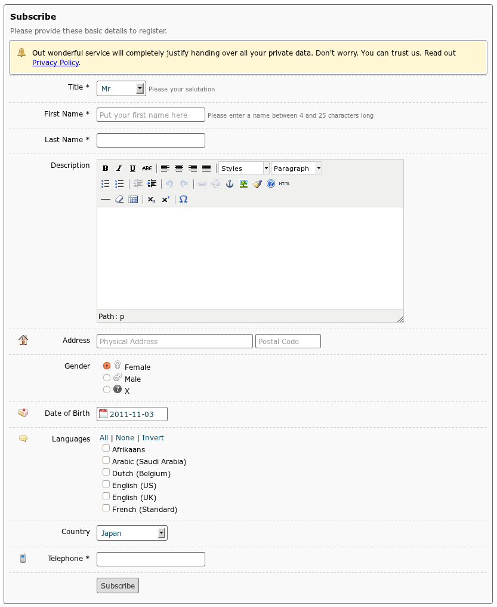
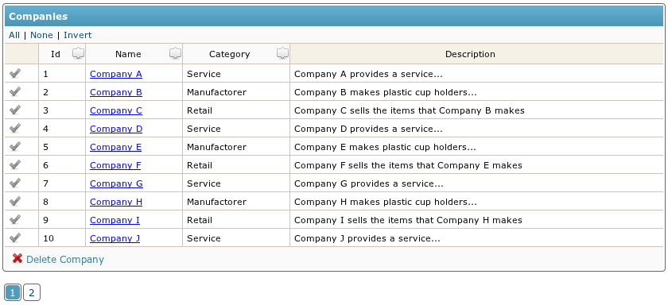
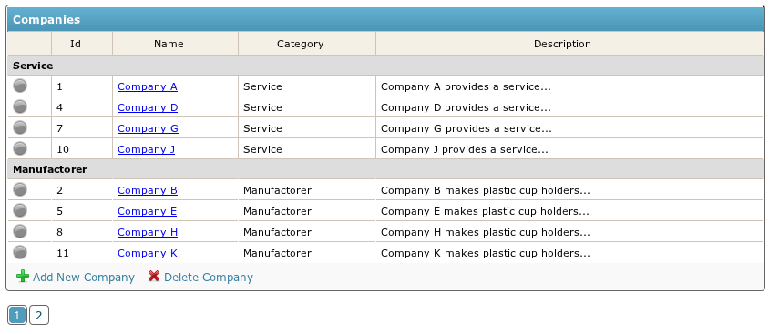

Meta Builder
=======
Meta Builder Library v1.1
http://www.shone.co.za/

Copyright (c) 2010 Thomas Shone
Licensed under the Creative Commons Attribution 3.0 Unported
License. See license.txt

The Meta Builder Library is a simple library to construct
and render forms using an abstracted meta description of the
form.

This is useful for rapid development of interfaces that will
work consistently and provide enough flexibility to not
require special cases which often plague form builders.

Example Screenshots
-----

This library has seperated the code into 4 major sections:

1. Builder Classes
-----
This code is used to generate valid DOM based on the meta
data description it is provided with.

2. Build Helper Classes
-----
This can be used to generate the meta data by creating
objects, assigning them attributes and adding them to valid
parent objects.

3. Javascript Libraries
-----
All the javascript is seperated from the meta data and is
attached after rendering using jQuery.

4. CSS
-----
There is no styling in the generated DOM elements. Rather,
the DOM created tends to be verbose with regards to classes
and many custom stylings can be set using these classes. If
these are not enough, you can add custom classes almost
anywhere in the meta data.

Attribution List
=======
PLEASE NOTE: As this meta builder is an amalgamation of
libraries, scripts and tools, some parts are not my own work
and I've listed below the major libraries included.

In any place where the code is not my own there are comments
or, in the case of complete libraries, the head of the file
contains the relevant author and licensing of the work.

1. Fugue Icons
2. Famfamfam Flag Icons
3. jQuery
    3.1 jQuery Tools
    3.2 jQuery Pagination/Ordering

1. Fugue Icons
-----
Located in html/images/16x16/*

Copyright (C) 2009 Yusuke Kamiyamane. All rights reserved.
The icons are licensed under a Creative Commons Attribution
3.0 license. <http://creativecommons.org/licenses/by/3.0/>

If you can't or don't want to provide a link back, please
purchase a royalty-free license. <http://www.pinvoke.com/>

I'm unavailable for custom icon design work. But your
suggestions are always welcome!
<mailto:yusuke.kamiyamane@gmail.com>

2. Famfamfam Flag Icons
-----
Located in html/images/flags/*

Flag icons - http://www.famfamfam.com

These icons are public domain, and as such are free for any
use (attribution appreciated but not required). Note that 
these flags are named using the ISO3166-1 alpha-2 country 
codes where appropriate. A list of codes can be found at 
http://en.wikipedia.org/wiki/ISO_3166-1_alpha-2

If you find these icons useful, please donate via paypal to 
mjames@gmail.com (or click the donate button available at 
http://www.famfamfam.com/lab/icons/silk)

Contact: mjames@gmail.com

3. jQuery
=======
Located in html/javascript/lib/jquery-1.3.2.min.js

jQuery JavaScript Library v1.3.2
http://jquery.com/

Copyright (c) 2009 John Resig
Dual licensed under the MIT and GPL licenses.
http://docs.jquery.com/License

Date: 2009-02-19 17:34:21 -0500 (Thu, 19 Feb 2009)
Revision: 6246

3.1 jQuery Tools
-----
Located in html/javascript/lib/jquery.tools.min.js

jQuery Tools v1.2.6 - The missing UI library for the Web

NO COPYRIGHTS OR LICENSES. DO WHAT YOU LIKE.
http://flowplayer.org/tools/

3.2 jQuery Pagination/Ordering
-----
Located in html/javascript/lib/grid.js

Built and adapted from the excellent tutorial here:
http://www.packtpub.com/article/jquery-table-manipulation-part1

Written by Jonathan Chaffer and Karl Swedberg
August 2007
